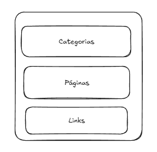

# Grids

Grids é um sistema de de regras, de regras pré estabelecidas para divisão de espaço e onde você inclui quadrado, linha, coluna, divisão áurea.

As formas mais básicas e mais simples de fazer é com linhas, colunas, linha horizontal, vertical.

### Grid em Colunas

No contexto digital, um grid em colunas organiza o conteúdo de um site ou aplicativo em colunas verticais, proporcionando um layout claro, organizado e esteticamente agradável. 12 colunas é o mais utilizado.

<figure><figcaption></figcaption></figure>

### Grid Modular

É uma estrutura que divide o espaço em módulos de dimensões iguais, criando uma malha organizada e repetitiva. Cada módulo serve como um container para um elemento específico do design, como uma imagem, texto o

<figure><figcaption></figcaption></figure>

### Grid Hierárquico

Um grid hierarquico funciona como um mapa mental visual, mas dentro de uma estrutura rígida. Ele divide o espaço em áreas de diferentes tamanhos para destacar a importância relativa dos elementos. É como criar uma hierarquiva visual, onde os elementos mais importantes ocupam as áreas maiores e mais visiveis.

<figure><figcaption></figcaption></figure>

### Grid Flexível

um grid flexível é um sistema de layout que se adapta dinamicamente a diferentes tamanhos de tela. Ao contrário dos grids fixos, que mantém suas dimensões independentement5e do dispositivo, os grids flexíveis se ajustam para garantir a melhor experiência visual em qualquer tela, desde smartphones até desktops.&#x20;

<figure><figcaption></figcaption></figure>

